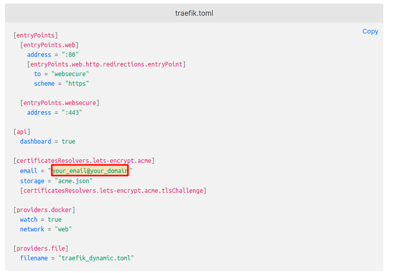

# Project Setup

This project demonstrates how to set up a service using Docker Compose with environment variables for configuring your application.

## Getting Started

1. Clone this repository to your local machine.
2. Navigate to the project directory.

### Prerequisites

- Docker and Docker Compose should be installed on your system.

### Configuration

1. Creamos el archivo acme.json, el cual funciona como deposito de los certificados SSL.

```touch acme.json

2. Establecemos los permisos adecuados para archivo acme.json. 

```chmod 600 acme.json

3. Agregaremos nuestro email para recibir los mensajes sobre los certificados.

```nano
traefik.toml



3. Añadimos un usuario y contraseña para Traefik. 

3.0. Necesitamos un usuario y una contraseña, pero esta contraseña debe estar encriptada. Para ello, usamos la página htaccesstools.

```https://www.htaccesstools.com/htpasswd-generator

3.1. Seteamos nuestro usuario y contraseña encriptada:


4. Creamos la red para que Docker pueda trabajar con Traefik:

docker network create web

### Running the Application

Run the following command to start the service:

```sh
docker-compose up -d

### References:

- https://blog.saiyans.com.ve/2022/04/12/traefik-2/
- https://github.com/tomasmetal23/traefikv2-with-letsencrypt
- https://www.digitalocean.com/community/tutorials/how-to-use-traefik-v2-as-a-reverse-proxy-for-docker-containers-on-ubuntu-20-04
